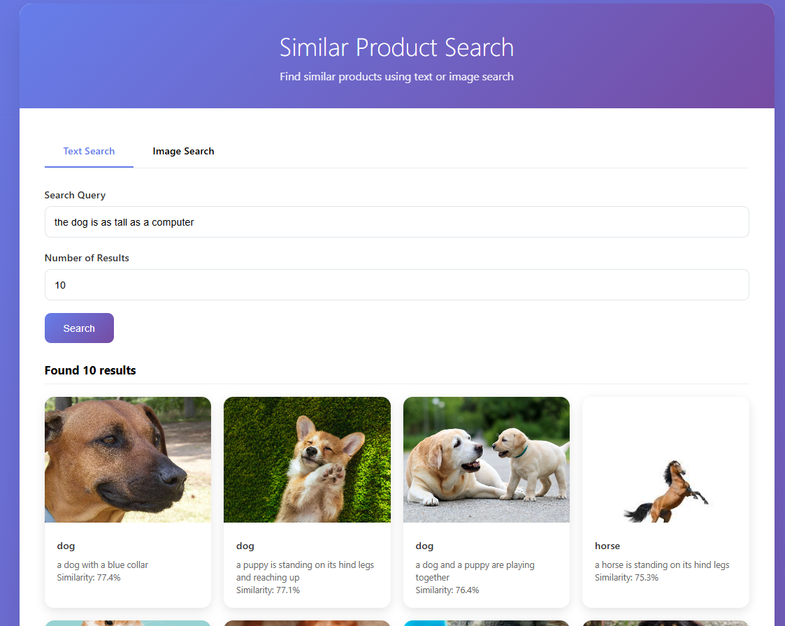

# Similar Product Search

A Flask web application that provides text and image search functionality for finding similar products. The application features a modern, responsive UI with debounced text search and image upload capabilities.



## Features

- **Text Search**: Real-time search with debouncing (500ms delay)
- **Image Search**: Upload images to find similar products
- **Modern UI**: Beautiful, responsive design with Alpine.js
- **Real-time Feedback**: Loading states and success/error messages
- **Configurable Results**: Adjustable number of search results

## Installation

1. **Install Python dependencies**:
   ```bash
   pip install -r requirements.txt
   ```

2. **Ensure the uploads directory exists**:
   ```bash
   mkdir -p app/uploads
   ```

## Running the Application

1. **Navigate to the app directory**:
   ```bash
   cd app
   ```

2. **Run the Flask application**:
   ```bash
   python app.py
   ```

3. **Access the application**:
   Open your browser and go to `http://localhost:5000`

## Usage

### Text Search
- Type your search query in the text input field
- The search will automatically trigger after 500ms of inactivity (debouncing)
- Adjust the number of results using the "Number of Results" field
- Click the "Search" button for immediate search

### Image Search
- Click on the "Image Search" tab
- Upload an image file (supported formats: PNG, JPG, JPEG, GIF, BMP, WEBP)
- Adjust the number of results if needed
- Click "Search Similar Images" to find similar products

## API Endpoints

- `GET /` - Main application page
- `POST /search/text` - Text search endpoint
- `POST /search/image` - Image search endpoint
- `GET /uploads/<filename>` - Serve uploaded files

## Technical Details

### Frontend
- **Alpine.js**: For reactive UI components and debounced search
- **CSS Grid**: For responsive result layout
- **Modern CSS**: Gradients, animations, and responsive design

### Backend
- **Flask**: Web framework
- **Werkzeug**: File upload handling
- **Pillow**: Image processing support

### Search System
The application integrates with your existing search system through the `SearchSystemFactory`. Make sure your search system implements:
- `text_search(query, top_k)` method
- `image_search(image_path, top_k)` method

## File Structure

```
app/
├── app.py              # Main Flask application
├── templates/
│   └── index.html     # Main application template
├── uploads/           # Directory for uploaded images
└── static/           # Static assets (CSS, JS)
```

## Configuration

The application can be configured by modifying the following settings in `app.py`:

- `MAX_CONTENT_LENGTH`: Maximum file upload size (default: 16MB)
- `UPLOAD_FOLDER`: Directory for uploaded files (default: 'uploads')
- `ALLOWED_EXTENSIONS`: Supported image file types

## Error Handling

The application includes comprehensive error handling for:
- Invalid file types
- Missing search queries
- Network errors
- Server errors

All errors are displayed to the user with appropriate messaging.
